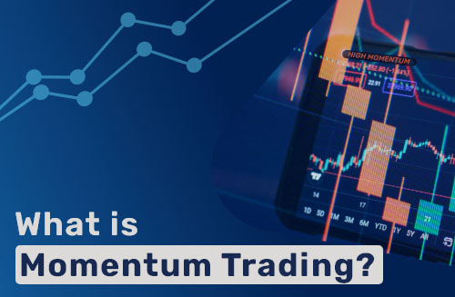

 
   

Momentum investing is a trading strategy in which investors buy securities that are rising and sell them when they look to have peaked.
The goal is to work with volatility by finding buying opportunities in short-term uptrends and then sell when the securities start to lose momentum.
Then, the investor takes the cash and looks for the next short-term uptrend, or buying opportunity, and repeats the process.
Skilled traders understand when to enter into a position, how long to hold it for, and when to exit; they can also react to short-term, news-driven spikes or selloffs.
Risks of momentum trading include moving into a position too early, closing out too late, and getting distracted and missing key trends and technical deviations.

